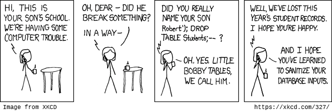

# SQL Injection

SQL-инъекция - одна из наиболее известных атак. Эта атака представляет собой внедрение кода, в котором злоумышленники используют уязвимости сайта для отправки в базу данных специальных SQL запросов, которые могут вносить любые изменения либо в худшем случае удалить всю базу данных.

С ростом популярности PDO и ORM количество атак значительно уменьшилось. Но следует помнить, что использование PDO и так называемых `prepared statements` не всегда гарантирует полноценную защиту от инъекций.

### Пример

```php
// GET data is sent through URL: http://example.com/get-user.php?id=1 OR id=2;
$id = $_GET['id'] ?? null;

// Select user based on the above ID
// bump! Here SQL code GET data gets injected in your query. Be careful to avoid
// such coding and use prepared statements instead
$sql = "SELECT username, email FROM users WHERE id = " . $id;
```
Можно подумать, что этот пример притянут за уши, ведь все уже давно используют PDO или ORM любимого фреймворка, которые исключают возможность подобной атаки. В таком случае посмотрите на [пример](https://phpdelusions.net/pdo/sql_injection_example), в котором и PDO может быть беспомощен.

### Защита

* Для предотвращение атак всегда необходимо валидировать входящие данные.

* Никогда не показывайте пользователям ошибки, в которых содержится информация о структуре БД, названия полей, таблиц.

* При возможности ограничивайте права на БД для пользователя, от имени которого делает изменения ваше приложение.

* Отключайте возможность делать множественные запросы, если иного не требует логика вашего приложения.

* Правильно используйте PDO и `prepared statements`.

* SQL-инъекции не могут быть предотвращены исключительно с помощью функций `htmlentities()` и `add_slashes()`. Они изначально не предназначены для обеспечения безопасности БД.

* https://paragonie.com/blog/2015/05/preventing-sql-injection-in-php-applications-easy-and-definitive-guide

 

